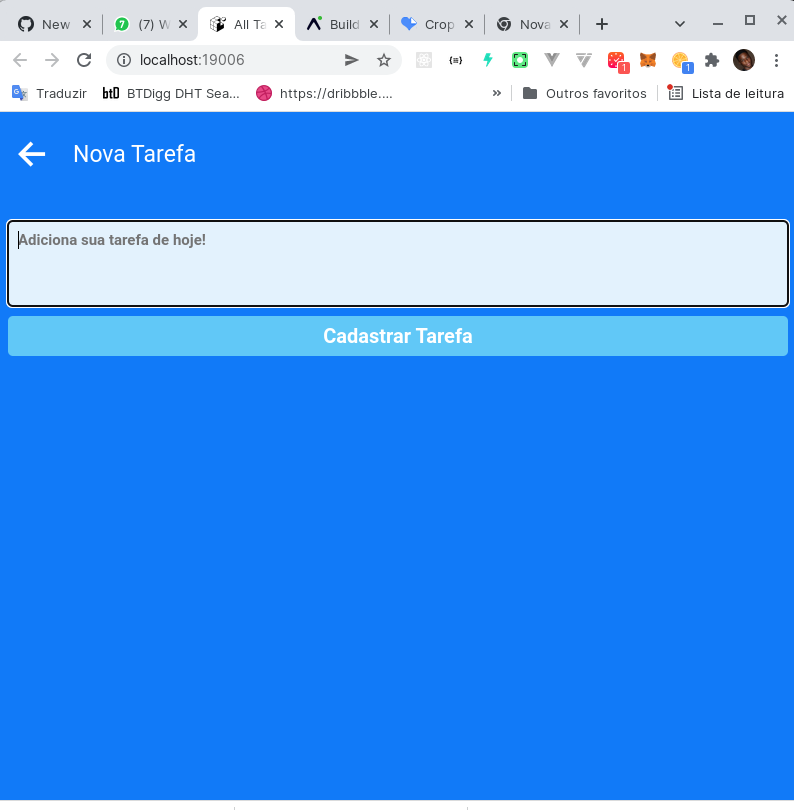
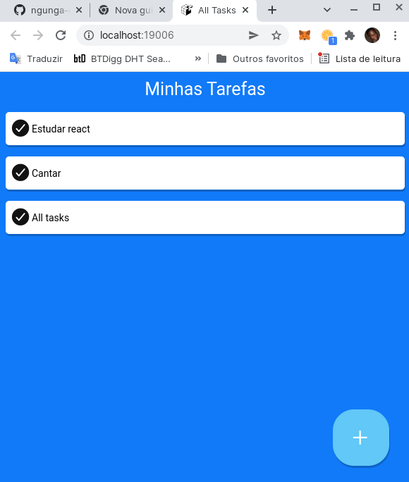

# All-Tasks
All Tasks é um aplicativo de listar as tarefas do seu dia-a-dia!
All Tasks é um aplicativo que te permite fazer o controlo das tuas tarefas diárias.
Você podes adicionar uma tarefa e quando terminar , podes remover da sua lista.

   
All Tasks
=========

1- Ilustração do All Tasks
--------------------------

2- Ilustração do All Tasks
--------------------------

Para para conseguires usar o All Tasks tens que instalar o Expo [Expo Android](https://play.google.com/store/apps/details?id=host.exp.exponent&hl=en_US&gl=US)

Link para abrir o All Tasks no Expo

[All Tasks](https://expo.dev/@ngungadev/all-tasks)

*   Javascript
*   React Native
*   Expo
